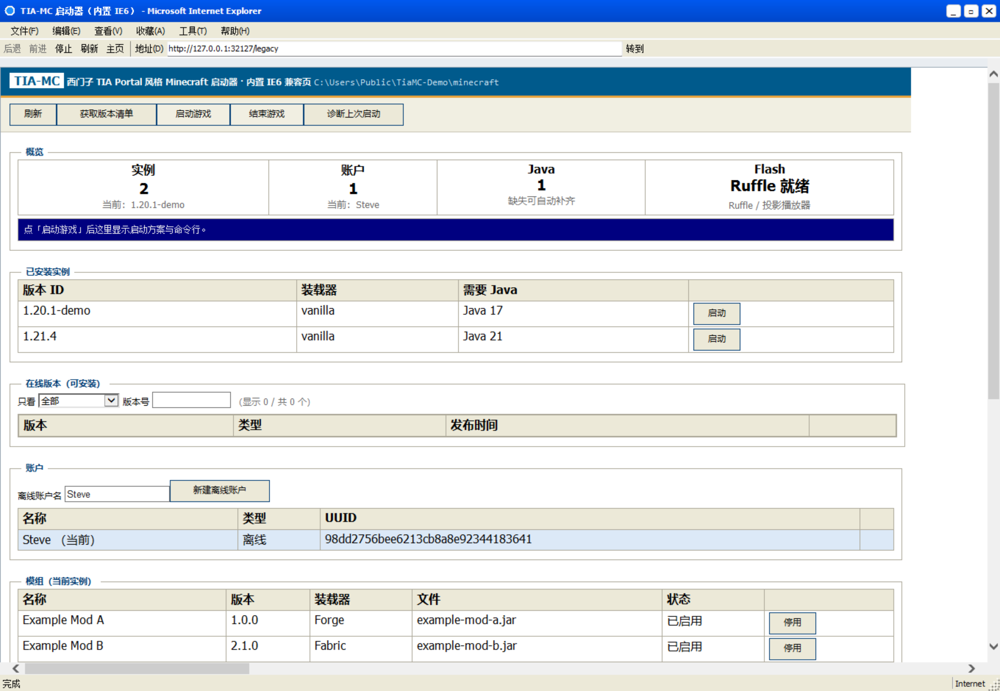
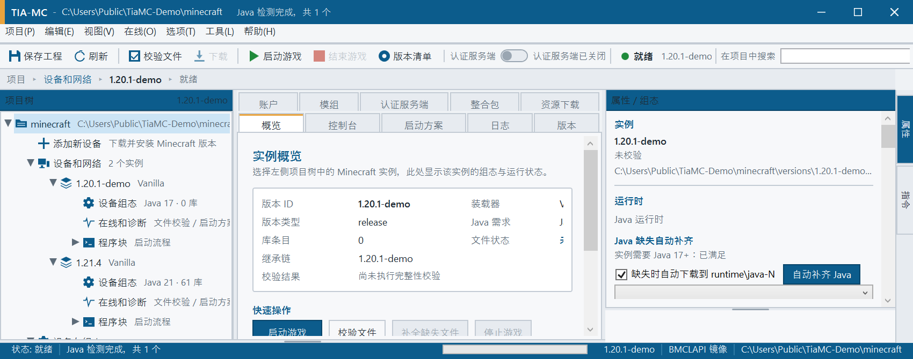
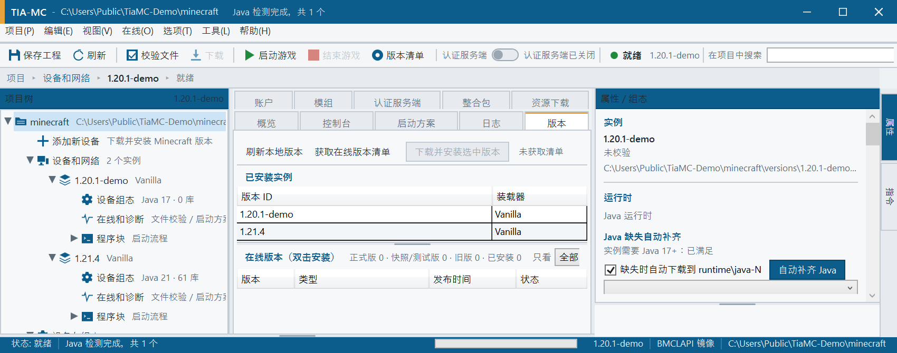
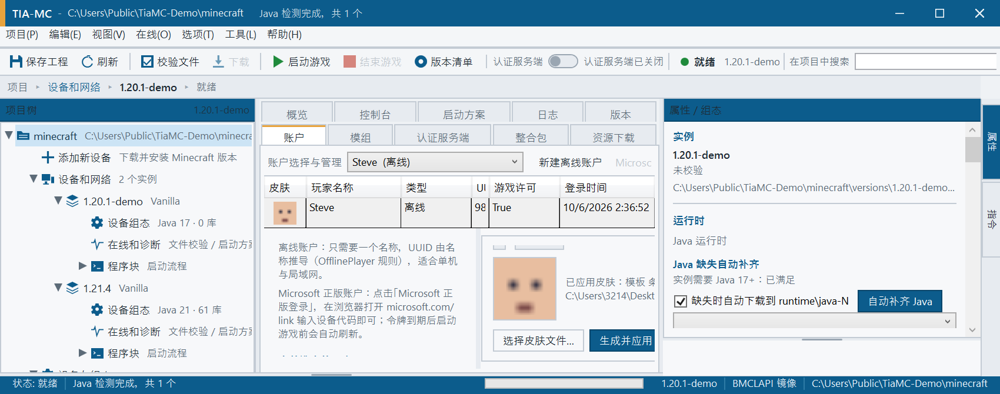
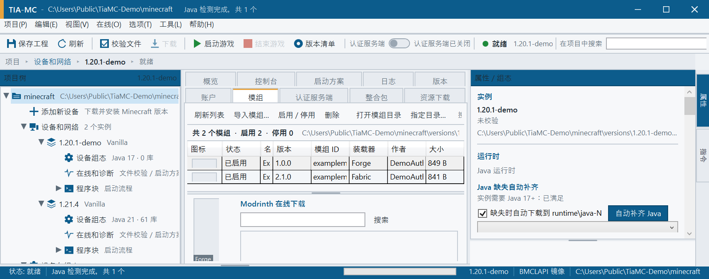
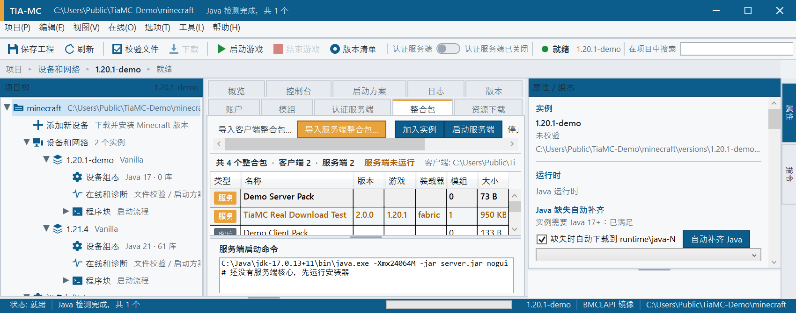
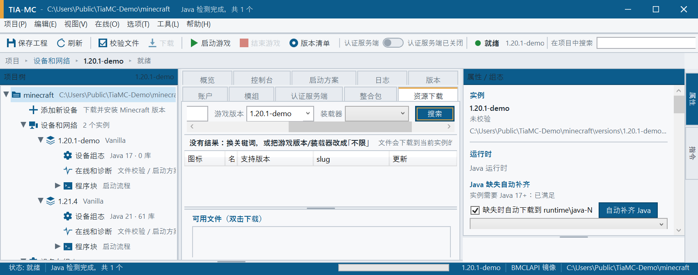
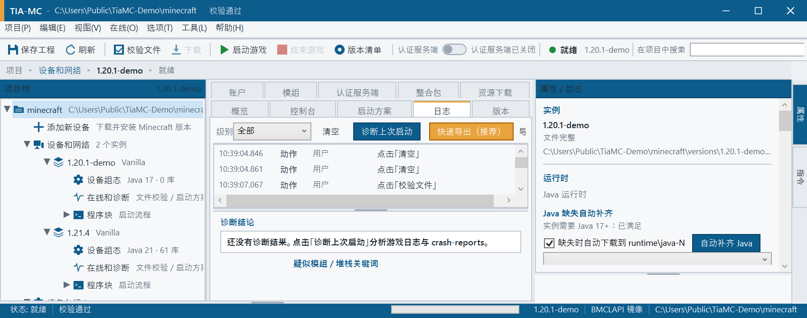
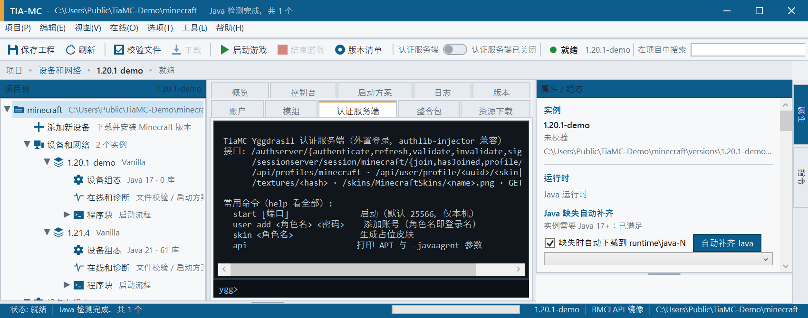

# TiaMC

[](https://github.com/kaiexi/TiaMC/actions/workflows/build.yml)
[](LICENSE)
[](THIRD-PARTY-NOTICES.md)
[](AI-DISCLOSURE.md)

> 用西门子 TIA Portal 的界面风格做的 Minecraft 启动器；启动内核的实现思路参考 ColorMC，
> 独立实现、无第三方 NuGet 依赖（仅 `System.Text.Json`）。**MIT 开源**。
> 代码与文档由 AI 编程助手在人类指导下生成，详见 **[AI-DISCLOSURE.md](AI-DISCLOSURE.md)**。
### TIA-MC —— 西门子 TIA Portal 风格的 Minecraft 启动器

用**西门子 TIA Portal（博途）**的界面语言（工业蓝标题栏 + 功能区 Ribbon + 项目树 + 属性组态面板 + 输出窗口 + 状态栏）
重新设计一个 Minecraft 启动器，启动内核的设计与实现参考 **[ColorMC](https://github.com/Coloryr/ColorMC)**（`Coloryr/ColorMC`）的启动流程。

```
启动器的"工程"隐喻：
  .minecraft 目录        ->  项目 (Project)
  versions/<id> 版本      ->  设备/实例 (Device / Instance)
  版本 JSON + 库 + 资源   ->  组态 (Configuration)
  启动前校验 / 补全文件   ->  编译并下载 (Compile and download)
  启动游戏                ->  转至在线 (Go online)
  控制台 / 诊断日志       ->  输出窗口 / 诊断 (Diagnostics)
```

---

## Web GUI 版（内置 IE6 窗口 + Flash）

除了桌面版（WPF），仓库里还有一个 **`TiaMC.Web`**：**同一套启动内核**（`TiaMc.Core` + `LaunchService`），
但界面是**浏览器里的网页**，并且**软件内置一个 IE6 外观的浏览器窗口，启动就自动打开它**。



### 怎么跑
```powershell
dotnet run --project src\TiaMc.Web            # 默认打开内置 IE6 窗口（http://127.0.0.1:32123/legacy）
dotnet run --project src\TiaMc.Web -- --browser=default   # 改用系统默认浏览器打开现代版页面 /
dotnet run --project src\TiaMc.Web -- --ie6-quirks        # 内置窗口用 IE5 quirks 文档模式（真·IE6 排版）
dotnet run --project src\TiaMc.Web -- --config D:\TiaMC\config   # 指定配置目录；--port 指定端口
```

### 内置 IE6 是怎么做的
Windows 上 2001 年的 IE6 早已随系统更新消失，但**它当年的引擎 MSHTML/Trident 仍在系统里**：
WinForms 的 `WebBrowser` 控件就是这个引擎的封装，所以内置浏览器**不需要额外安装 IE6**。

| 组成 | 做法 |
|------|------|
| 渲染引擎 | 系统自带 MSHTML/Trident（`WebBrowser` 控件），零外部依赖、零 NuGet |
| 文档模式 | `HKCU\...\FeatureControl\FEATURE_BROWSER_EMULATION`：默认 `11001`（IE11 模式，页面 JS 能跑）；`--ie6-quirks` 时为 `5000`（IE5 quirks = IE6 当年排版） |
| 外观 | 窗口自己画：蓝色渐变标题栏 + 最小化/最大化/关闭、IE6 菜单栏（文件/编辑/查看/收藏/工具/帮助）、工具栏（后退/前进/停止/刷新/主页 + 地址栏 + 转到）、底部状态栏（含 Internet 区域） |
| 页面 | 内置窗口加载 **`/legacy`**（ES3 + `XMLHttpRequest` + 表格布局，`X-UA-Compatible: IE=5`）；现代浏览器访问 `/` 得到 ES5+CSS3 的现代页面 |
| 字体 | XP 时代字体：Tahoma / Microsoft Sans Serif / MS Sans Serif / 宋体，控制台用 Fixedsys |

### Flash 支持（两条路）
Flash Player 插件已于 2020-12-31 EOL，现代浏览器不再加载它，所以：

1. **Ruffle（推荐，网页内直接播）**：开源 Flash 模拟器（MIT/Apache-2.0，WASM）。在 Flash 卡片点「获取 / 更新 Ruffle」，
   启动器会从 Ruffle 官方发布下载 self-hosted 包解压到 `<配置目录>\flash\ruffle`，页面里加载 `ruffle.js` 后
   `<object>/<embed>` 的 SWF 就在浏览器/内置 IE6 窗口内播放——**不需要任何插件**。实测：Ruffle v0.6.0 就绪，SWF 库内 `ruffle-test.swf` 可播。
2. **Flash 投影播放器（真 Flash 运行时）**：若本机已有 `flashplayer_*.exe`，启动器会自动检测（也会扫描常见安装目录），
   在「设置 → Flash 投影播放器路径」可手动指定。「用投影播放器打开」会把本地 SWF 或 SWF 链接交给它播放。

SWF 库位于 `<配置目录>\flash\swf`：网页上可以拖入 `.swf`、选择文件上传（会校验 `FWS/CWS/ZWS` 头）或直接填链接。

### Web API（浏览器界面就是调这些）
`/api/state`、`/api/versions`、`/api/manifest/refresh`、`/api/instance/install`、`/api/launch`、`/api/stop`、
`/api/diagnose`、`/api/java`、`/api/java/provision`、`/api/accounts`、`/api/accounts/offline`、`/api/accounts/select`、
`/api/mods`、`/api/mods/toggle`、`/api/settings`、`/api/logs?since=N`、`/api/flash`、`/api/flash/ruffle`、
`/api/flash/upload`、`/api/flash/open`、`/api/flash/projector`；静态资源为 `/`、`/legacy`、`/app.css`、`/app.js`、`/legacy.js`、`/flash/ruffle.js`、`/flash/swf/<名字>`。

> 说明：Web 版是**本机回环**服务（`127.0.0.1`），不对外监听；界面与桌面版共用同一份配置、账户、模组与日志。
## 界面预览

> 以下截图来自独立演示环境（`C:\Users\Public\TiaMC-Demo`、实例 `1.20.1-demo`、模组 `Example Mod A/B`），
> **不含本机路径、真实模组名或账户信息**；全部截图与说明见 [docs/SCREENSHOTS.md](docs/SCREENSHOTS.md)，采集脚本 `tools/capture-demo-shots.ps1`。

| | |
|---|---|
|  |  |
| **主界面**：功能区 + 项目树 + 工作页签 + 属性组态 + 输出窗口 | **版本页**：正式版 / 快照 / 旧版 分渠道筛选与配色徽章 |
|  |  |
| **账户与皮肤**：账户选择与管理集成一行，皮肤实时预览可选前/后/左/右/头部 | **模组页**：模组自带图标 + 装载器角标 + 中文界面 |
|  |  |
| **整合包页**：客户端 / 服务端分包（服务端橙色高亮） | **资源下载**：模组/整合包/资源包/光影，中文搜索 + 图标 |
|  |  |
| **日志页**：动作记录、崩溃诊断、快速导出（含 MC 日志） | **认证服务端**：内置 Yggdrasil，单终端 + 一键开关 |
## 隐私说明（本仓库不包含真实使用信息）

为了让仓库可以直接公开，以下内容**已从源码、文档、工具脚本与截图中移除或替换为中性示例**：

| 类别 | 处理方式 |
|------|----------|
| 本机绝对路径 | `C:\Users\<用户>\…` → `%USERPROFILE%\.minecraft` / `$PSScriptRoot` 相对路径 |
| 真实实例名 | `1.20.1-forge-<具体加载器版本>` → `1.20.1-forge` |
| 真实模组文件名 | `example-mod-a.jar` / `example-mod-b.jar` / `example-lib.jar`（原文件名已替换） |
| 测试账号 / 玩家名 | 只用 Minecraft 默认名 `Steve` 与 `ExamplePlayer`，不含真实账号 |
| 界面截图 | 随仓库提供的截图**全部由独立演示环境生成**（`C:\Users\Public\TiaMC-Demo`、`1.20.1-demo`、`Example Mod A/B`），不含本机路径与个人模组列表；采集脚本 `tools\capture-demo-shots.ps1` |
| 账户凭据 | 仓库内无任何令牌/密码；程序导出日志时也会对 `accessToken`/`refreshToken`/`clientToken`/`password`/`uuid` 脱敏 |
| 崩溃日志样本 | 崩溃分析规则用**合成日志**验证（`artifacts\diag-test` 不入库） |

> 说明：`ResourceCatalog` 内置的中文词典（例如 `机械动力→create`、`钠→sodium`）是**公开的模组名与作者名**，
> 用于给所有用户做中文检索，不属于个人信息。
## 关于 AI 编写（必读）

本项目的**源代码 / 文档 / 界面 / 脚本绝大部分由 AI 编程助手（DeepSeek Harness 的 `deepseek-flash` 模型）生成**，
人类用户负责提出需求、在真机上使用并反馈问题、逐项验收与决定开源。完整说明见 **[AI-DISCLOSURE.md](AI-DISCLOSURE.md)**。

要点：

* **验证过什么**：`dotnet build` 0 警告 0 错误（CI 每次推送重跑）；Yggdrasil 规范 13/13 自测；
  Modrinth 真实下载、Java 自动补齐（SHA-256 校验）、LittleSkin 外置登录与 mc-heads 皮肤获取均实测通过；每个界面改动都截图核对。
* **局限**：没有完整自动化测试体系，边界情况可能未覆盖；Windows 权限/DPI/输入法等只在有限环境验证；第三方服务可能变更导致功能暂时不可用。
* **许可与责任**：仍然 MIT，**不提供担保**；请自行审查后再用于生产。发现 AI 写错的地方，欢迎提 Issue / PR。
* **不要提交密钥**：导出日志会脱敏，但你自己的分支请确认没有硬编码令牌与密码。
## 本仓库涉及的开源项目（务必先看）

本项目 **MIT** 开源，源代码全部独立实现，**不含任何 GPL 项目的代码副本**。完整清单、许可与合规说明见
**[THIRD-PARTY-NOTICES.md](THIRD-PARTY-NOTICES.md)**，摘要如下：

| 开源项目 | 许可 | 以什么形式进入本项目 |
|----------|------|----------------------|
| [ColorMC](https://github.com/Coloryr/ColorMC) | Apache-2.0 | 仅**设计参考**：启动内核分层（版本 JSON 合并 → 规则 → 库/资源 → 占位符 → 启动） |
| [HMCL](https://github.com/HMCL-dev/HMCL) | GPL-3.0 | 仅**设计参考**：崩溃分析三层结构、内存/GC 设置、Java 管理；实现为 C# 重写 |
| [Axolotl](https://github.com/Mystic-Stars/Axolotl) | 自定义 | 仅**格式/产品思路参考**：四类内容共用一个搜索目录与中文词典格式（词典内容自建） |
| [LunaLauncher](https://github.com/AndreaFrederica/LunaLauncher/tree/meson/yggdrasil) | GPL-3.0 | 仅**技术规范参考**：Yggdrasil 13 个端点按公开规范自行实现（13/13 自测） |
| [PCL2](https://github.com/Meloong-Git/PCL) | 自定义 | 仅**思路参考**：BMCLAPI 优先、官方源回退的下载路线 |
| [Mem Reduct](https://github.com/henrypp/memreduct) | GPL-3.0 | 仅**API 用法参考**：`EmptyWorkingSet` / `NtSetSystemInformation` 内存回收，自行实现 |
| [authlib-injector](https://github.com/yushijinhun/authlib-injector) | 自定义 | **运行时下载**（外置登录首次启动），不打包、不修改 |
| [Eclipse Temurin (Adoptium)](https://adoptium.net/) | GPLv2+CE | **运行时下载**的 Java 运行时，不打包、不修改 |
| [BMCLAPI](https://bmclapi2.bangbang93.com/) · [Modrinth](https://docs.modrinth.com/) · Mojang 官方源 | 各自条款 | 联网接口/镜像，不含代码 |
| [.NET 10 / WPF](https://dotnet.microsoft.com/) | MIT | 运行框架（唯一 NuGet 依赖：`System.Text.Json`） |

另外：**发布包与仓库都不包含** Minecraft 游戏文件、Java 运行时与 authlib-injector；
被参考的 GPL 项目源码副本（阅读用）也已从仓库移除，只在 [docs/LEARNINGS.md](docs/LEARNINGS.md) 保留本项目自己的结论。
Minecraft 是 Mojang Studios 的商标，本项目与 Mojang、Siemens 均无关联。
## 直接下载（Windows x64 · 免安装）

不想自己编译的话，直接取发布包：

| 文件 | 说明 |
|------|------|
| **TiaMC.exe** | 单文件免安装（自包含 .NET 10，约 56 MB）。双击即用，首次运行会在 exe 同目录创建 `config\`（设置/缓存/日志）与 `minecraft\`（游戏目录）——**便携模式，不写 %APPDATA%** |
| **TiaMC-<版本>-win-x64.zip** | 同上，另附 README / LICENSE / 第三方组件说明 |

下载地址：[GitHub Releases](https://github.com/kaiexi/TiaMC/releases/latest)

首次使用建议顺序：

1. 打开「版本」页 → **获取在线版本清单** → 选一个正式版 → **下载并安装选中版本**（默认走 BMCLAPI 镜像）；
2. 装完会自动补全库与资源文件，若本机缺少对应 Java，会提示并按需下载到 `runtime\java-<N>`（可在属性面板关掉）；
3. 「账户」页新建离线账户或 Microsoft 正版登录；离线账户可以换皮肤（本地文件 / 模板 / 外部皮肤站）；
4. 回到「设备与网络」选实例 → **启动游戏**；出问题看「日志」页，可**快速导出**完整日志（含 `latest.log`、`debug.log`、`crash-reports`）。

> 系统要求：Windows 10/11 x64。程序本身免安装，但首次启动游戏需要联网下载游戏文件。
## 1. 为什么参考 ColorMC

ColorMC 是一款活跃维护的跨平台 Minecraft 启动器（C# / Avalonia），它的 `ColorMC.Core` 把"启动一个 Minecraft"
拆成了职责清晰的几步。本项目**没有直接引用 ColorMC 的程序集**，而是学习它的分层与数据流，用零第三方依赖的
C# 重新实现了一遍，因此可以直接跑在 .NET + WPF 上。

### 从 ColorMC 学到的关键设计

| ColorMC 中的实现 | 位置（参考副本克隆在 `../ColorMC-ref`） | TIA-MC 中的对应实现 |
| --- | --- | --- |
| 版本 JSON 读取与 `inheritsFrom` 父版本合并 | `ColorMC.Core/Helpers/GameHelper.cs`、`LaunchPath/VersionPath.cs` | `TiaMc.Core/Minecraft/VersionRepository.cs` (`Merge`) |
| 库规则（rules / os / features）判定 | `ColorMC.Core/Helpers/CheckHelpers.cs` | `TiaMc.Core/Rules/RuleEvaluator.cs` |
| 库路径、natives 解压、classpath 组装 | `LaunchPath/LibrariesPath.cs`、`Game/GameLaunch.cs` (`MakeClassPathAsync`) | `Launch/LibraryResolver.cs`、`Launch/LaunchPlanner.cs` |
| `${...}` 占位符替换（含 `${classpath_separator}`） | `Game/GameLaunch.cs` (`ReplaceAll`) | `Launch/LaunchPlanner.cs` + `Utils/TextUtil.ReplaceMap` |
| V1(`minecraftArguments`) / V2(`arguments`) 双格式 | `Game/GameLaunch.cs` (`MakeV1GameArg` / `MakeV2GameArg`) | `Launch/LaunchPlanner.cs` (`Collect`) |
| Forge / NeoForge 新版走 `BootstrapLauncher`（`-p` 模块路径、`-DlibraryDirectory`） | `Game/GameLaunch.cs` (`MakeMainClass`、`MakeInstallForgeArg`) | `Minecraft/VersionJson.cs` (`UsesBootstrapLauncher`) + `LaunchPlanner` |
| 启动前检查缺失文件，再交给下载器 | `Game/GameLaunch.cs` (`CheckGameFileAsync` + `DownloadManager`) | `Integrity/IntegrityChecker.cs` + `Integrity/DownloadService.cs` |
| 托管 java 进程、转发 stdout/stderr、退出回调 | `Game/GameLaunch.cs` (`StartGameAsync` 中的 `Process`) | `Launch/GameProcess.cs` |
| 多版本共享 `libraries/`、`assets/`，实例只存差异 | `LaunchPath/*Path.cs` | `Minecraft/McPaths.cs` |

其他借鉴点：

* **重复库去重**：同一 `group:artifact` 出现在原版与装载器两份 JSON 里时，只保留版本更高的一条，且保留首次出现的顺序
  （ColorMC 用 `Dictionary` + `AddOrUpdate` 达到同样目的）。见 `VersionRepository.DeduplicateLibraries`。
* **Forge 1.20.1 的 JSON 是自包含的**：现代 Forge 安装器写出的 `<id>.json` 不带 `inheritsFrom`，
  但把 `arguments.jvm/game` 和 117 个库全部写全，主类是 `cpw.mods.bootstraplauncher.BootstrapLauncher`。
  因此启动器**不需要**用 installer 自行安装 Forge，只要按 JSON 组装 classpath + `-p` 模块路径即可
  （这正是 ColorMC 在 1.17+ 用 ForgeWrapper/BootstrapLauncher 解决的同一件事）。
* **规则默认拒绝**：`rules` 数组按顺序求值，最后匹配的规则生效；特性开关（`is_demo_user`、`has_custom_resolution`…）
  缺失时视为 `false`，因此 `--width/--height` 只会被加入一次。
* **账户只提供四个值**：`name / uuid / accessToken / userType`。ColorMC 用 `LoginObj` 做同样的抽象，
  所以接入微软登录不需要改参数生成逻辑（见第 4 节）。

---

## 2. 项目结构

```
TiaMC/
├─ TiaMC.sln
├─ src/
│  ├─ TiaMc.Core/                    # 启动器内核（net10.0，零第三方依赖）
│  │  ├─ Minecraft/  McPaths.cs            路径布局（.minecraft 各子目录）
│  │  │             VersionJson.cs         版本 JSON 数据模型
│  │  │             VersionRepository.cs   读取 + inheritsFrom 合并 + 库去重 + 版本比较
│  │  ├─ Json/       ArgumentListConverter.cs  arguments 数组的 string/object 多态解析
│  │  ├─ Rules/      RuleEvaluator.cs      rules/os/features 判定
│  │  ├─ Launch/     LibraryResolver.cs    maven 坐标 -> 本地路径 / natives 分类器
│  │  │             LaunchPlanner.cs       生成完整 java 命令行（本项目的心脏）
│  │  │             LaunchPlan.cs          启动方案 + 用户选项
│  │  │             GameProcess.cs         进程托管、输出转发、退出通知
│  │  ├─ Accounts/   MinecraftAccount.cs   离线账户与 OfflinePlayer UUID
│  │  │             AccountStore.cs        多账户持久化（accounts.json）
│  │  │             MicrosoftAuth.cs       设备代码 OAuth -> Xbox -> XSTS -> Minecraft
│  │  │             MicrosoftTokenResponse.cs  JSON / 表单两种令牌响应解析
│  │  ├─ Java/       JavaDetector.cs       JAVA_HOME / PATH / 常见安装目录 + release 文件 + `java -version` 探测
│  │  ├─ Integrity/  IntegrityChecker.cs   完整性校验（库 / 客户端 Jar / 资源索引 / 资源对象）
│  │  │             DownloadService.cs     并发下载 + 进度
│  │  ├─ Net/        ManifestClient.cs     版本清单获取与原版安装（支持 BMCLAPI 镜像）
│  │  └─ Utils/      TextUtil.cs / AppInfo
│  ├─ TiaMc.Cli/                     # 无界面的内核测试工具（tiamc-cli.exe）
│  └─ TiaMc.App/                     # WPF 界面（net10.0-windows，TIA Portal 风格）
│     ├─ App.xaml                    合并主题、注册转换器与窗口图标
│     ├─ Assets/TiaMC.ico            应用/窗口图标（由 tools/make-icon.ps1 生成）
│     ├─ Themes/TiaTheme.xaml        整套工业风样式与矢量图标（217 个资源键）
│     ├─ Views/MainWindow.xaml       标题栏 + 菜单 + Ribbon + 项目树 + 工作区 + 属性面板 + 输出窗口 + 状态栏
│     │        DeviceCodeWindow.xaml 正版登录设备代码对话框
│     │        TextInputWindow.xaml  离线账户名输入对话框
│     ├─ ViewModels/                 MainViewModel / ConsoleViewModel / TreeNode / DeviceCodeViewModel
│     ├─ Services/                   AppConfig（config.json）/ LaunchService / LogService
│     └─ Converters/                 值转换器（含皮肤头像裁剪）
├─ tools/                            make-icon.ps1 / capture-window.ps1 / capture-menu.ps1
├─ dist/                             发布产物：自包含 TiaMC.exe
└─ docs/ARCHITECTURE.md             启动流程逐步对照说明
```

---

## 3. 启动流程（与 ColorMC 的逐步对照）

```
选择实例 (versions/<id>/<id>.json)
        │
        ├─ 0. 准备账户            AccountStore.Selected + EnsureAccountReadyAsync
        │      正版令牌过期时自动 refresh_token 刷新
        │
        ├─ 1. 读取 JSON           VersionRepository.Load         <- ColorMC VersionPath.GetVersion
        │      若有 inheritsFrom，则递归取父版本并合并
        │
        ├─ 2. 完整性校验          IntegrityChecker.Check         <- ColorMC CheckGameFileAsync
        │      库 / 客户端 Jar / assets 索引 / assets 对象
        │      缺失 -> DownloadService（可走 BMCLAPI 镜像）
        │
        ├─ 3. 匹配 Java           JavaDetector.Detect + Filter    <- ColorMC JavaHelper.FindJava / JvmPath
        │      按版本 JSON 的 javaVersion.majorVersion 选择
        │
        ├─ 4. 规则筛选            RuleEvaluator.IsAllowed         <- ColorMC CheckRule.CheckAllow
        │      逐库、逐参数判定 os.name / os.arch / features
        │
        ├─ 5. 解压 natives        LaunchPlanner.ExtractNatives    <- ColorMC 的 natives 解压
        │      分类器 natives-windows-64 / natives-windows ...
        │
        ├─ 6. 组装 classpath      LaunchPlanner                   <- ColorMC MakeClassPathAsync
        │      库(去重后) + 客户端 Jar，分隔符 ';'
        │
        ├─ 7. 参数替换            LaunchPlanner                   <- ColorMC ReplaceAll
        │      ${auth_player_name} ${version_name} ${game_directory}
        │      ${assets_root} ${assets_index_name} ${auth_uuid}
        │      ${auth_access_token} ${user_type} ${natives_directory}
        │      ${library_directory} ${classpath_separator} ${classpath}
        │      ${launcher_name} ${launcher_version} ...
        │
        ├─ 8. 启动进程            GameProcess.Start               <- ColorMC StartGameAsync
        │      WorkingDirectory = .minecraft 根目录，stdout/stderr 逐行转发到界面
        │
        └─ 9. 退出回调            退出码 + 原因（正常退出 / 失败 / 被终止）
```

### 实测（本机 `.minecraft`，含 Forge 47.4.26）

```
$ tiamc-cli list --mc %USERPROFILE%\.minecraft
  1.20.1-forge   loader=Forge    java=17  libs=117  jar=yes
  1.20.1                 loader=Vanilla  java=17  libs=88   jar=yes

$ tiamc-cli check 1.20.1-forge
  库 72 | 资源 3598 | 已存在 3672 | 缺失 0 (0 B)

$ tiamc-cli launch 1.20.1-forge --max 4096
  [launch] 检测到 BootstrapLauncher (Forge/NeoForge 1.17+)
  [Render thread/INFO] [minecraft/Minecraft]: Setting user: Steve
  [modloading-worker-0/INFO] [ne.mi.co.MinecraftForge/FORGE]: MinecraftForge v47.4.26 Initialized
  [Render thread/INFO] [minecraft/Minecraft]: Stopping!      <- 退出码 0
```

---

## 4. 账户：离线与正版（Microsoft）

账户与组态分开存放：`%APPDATA%\TiaMC\accounts.json` 保存账户列表，`config.json` 保存启动参数。
启动时只读取当前选中账户，因此**切换账户不需要改任何启动代码**。

### 离线账户

* 玩家名称 → `uuid = MD5("OfflinePlayer:<name>")`（与官方启动器一致，设置 version/variant 位）；
* 启动参数固定为 `--accessToken 0 --userType legacy`；
* 支持保存多个离线账户，随时切换；至少保留一个账户。

### Microsoft 正版账户

采用 **OAuth 2.0 设备代码（device code）流程**：无需内嵌浏览器、无需 client secret，
界面显示 `microsoft.com/link` 与 8 位设备代码，用户在浏览器完成登录后自动继续：

```
① POST login.live.com/oauth20_connect.srf       -> device_code / user_code
   轮询 oauth20_token.srf                       -> Microsoft access_token + refresh_token
② POST user.auth.xboxlive.com/user/authenticate -> Xbox Live token + user hash (uhs)
③ POST xsts.auth.xboxlive.com/xsts/authorize    -> XSTS token（401 时按 XErr 给出中文提示）
④ POST api.minecraftservices.com/authentication/login_with_xbox -> Minecraft access_token
⑤ GET  api.minecraftservices.com/entitlements/mcstore          -> 是否拥有游戏
⑥ GET  api.minecraftservices.com/minecraft/profile             -> uuid / 名称 / 皮肤 / 披风
```

* 令牌过期（< 5 分钟）时，**启动游戏前自动用 refresh_token 刷新**，失败则中止启动并提示重新登录；
* 账户列表显示皮肤头像（`SkinHeadConverter` 直接从皮肤材质裁出头像，含帽子叠加层）；
* 交互：功能区「当前账户」下拉、账户页面表格、属性面板「账户」区块三处都能切换，点选即时生效；
* 登录失败按 XErr 分类提示：无 Xbox 账户 / 地区不支持 / 未成年人家庭组 / 已封禁 等。

> 内置 OAuth 客户端 ID 是社区通用的 live.com 客户端（`MicrosoftAuth.DefaultClientId`）。
> 若要发布自己的构建，请在 Azure 门户注册应用（**受支持的账户类型 = 仅个人 Microsoft 账户**、
> 允许公共客户端流、scope 含 `XboxLive.signin offline_access`），然后
> `new MicrosoftAuth(clientId: "你的客户端ID")`，内核会自动改走 AAD consumers 设备代码端点。

命令行可以跑完整登录流程（便于排查）：

```powershell
dotnet run --project src\TiaMc.Cli -- login --account myaccount   # 正版设备代码登录
dotnet run --project src\TiaMc.Cli -- login --offline Steve       # 离线账户
```

---

## 5. 界面设计：照着真实博途逐项对齐

界面不是"凭印象"做的：主机上跑着 VMware 里的 **TIA Portal V16 实例**，
按真实窗口逐块对照实现。**出于隐私考虑，仓库不附带界面截图**（截图会暴露本机路径与个人模组列表）；需要看图请自行运行并用 `tools\capture-window.ps1` 生成。

| 真实 TIA Portal 元素（对照截图） | 本项目的实现 |
| --- | --- |
| 标题栏：黑/深灰底 + 左缘橙色竖条 + `Siemens - C:\...\项目2\项目2` | `MainWindow` 第 0 行：品牌色标题栏 + 6px `Tia.Accent` 左缘条 + `TIA-MC - <项目路径>` |
| 菜单栏：项目(P) 编辑(E) 视图(V) 插入(I) 在线(O) 选项(N) 工具(T) 窗口(W) 帮助(H) | 同名同序分组（项目/编辑/视图/在线/选项/工具/帮助），动作直接映射启动流程 |
| 工具栏：图标+文字按钮（保存项目、编译、转至在线/离线…）+ 竖线分组 + 右侧「在项目中搜索」 | `Tia.Button.Tool` 图标+文字按钮，3 组分隔，右侧「在项目中搜索」过滤项目树 |
| 项目树面板：深蓝标题条「项目树」、`设备` 选项卡、树节点 `项目2 → 添加新设备 / 设备和网络 → PLC → 设备组态 / 在线和诊断 / 程序块 → Main [OB1]` | 同结构：`<项目名> → 添加新设备 / 设备和网络 → <实例> → 设备组态 / 在线和诊断 / 程序块 → 启动控制台·启动方案·诊断日志` |
| 编辑器区：面包屑 `项目 ▶ 设备和网络 ▶ Main [OB1]` + 文档选项卡 | 面包屑 `项目 ▸ 设备和网络 ▸ <实例> ▸ 状态` + 6 个文档选项卡 |
| 右侧「指令」面板：可折叠分组（收藏夹 / 基本指令 / 扩展指令 / 工艺 / 通信），每组名称+描述两列 | 同构「指令」面板：收藏夹 / 基本指令 / 在线与访问 / 工艺对象 / 诊断，行=名称+描述，双击执行 |
| 右侧竖排窗格切换（指令 / 测试 / 任务 / 库 / AddIns） | 右缘 `Properties` / `Instructions` 竖排切换（`Tia.PaneTab`） |
| 底部「详细视图」+ 属性页（常规 / 信息 / 诊断） | 底部「输出窗口」 + 右侧属性面板（实例 / 运行时 / 内存与性能 / 账户 / 路径与下载 / 高级） |
| 状态栏：深蓝底、状态与项目信息 | 同色状态栏：状态 / 消息 / 进度 / 实例 / 下载源 / 项目路径 |
| 工业风配色：浅灰工作区、1px 边框、无圆角、无阴影、橙色仅用于强调 | `Themes/TiaTheme.xaml`：`Tia.Brand #0C5C8C`、`Tia.Accent #E8A33D`、`Tia.Selection #CCE4F5` |
| 不留大片白底 | 容器控件（`TabControl` / `ScrollViewer` / `TreeView` / `ListBox` / `ListView`）与 DataGrid 的**空区统一为面板灰** `Tia.PanelBg`，表格行保持白色/斑马，模组、账户、版本三个页面底部空白处改为操作提示文案 |
| 面板可拖动改大小 | 项目树↔编辑器、编辑器↔右侧面板（水平分隔条）、属性↔指令面板（垂直分隔条）、控制台高度、模组列表↔模组详情、已安装↔在线版本 都是 `GridSplitter` |
| 图标 | 35+ 个纯矢量 `PathGeometry` 图标，无位图依赖 |

### 二级 / 三级菜单一览

| 一级 | 二级 | 三级 |
| --- | --- | --- |
| 项目 | 打开目录 | 游戏目录 / 配置目录 / 当前实例目录 / mods / saves |
| 项目 | 复制路径 | 游戏目录 / 当前实例路径 / 当前实例 JSON |
| 视图 | 工作区页面 | 概览 / 启动控制台 / 启动方案 / 诊断日志 / 版本管理 / 账户 |
| 视图 | 项目树 | 展开全部 / 折叠全部 / 刷新 |
| 视图 | 输出窗口 | 复制输出 / 清空输出 |
| 在线 | 文件与下载 | 校验当前实例文件 / 补全缺失文件 |
| 在线 | 下载源 | BMCLAPI 镜像 / Mojang 官方 |
| 选项 | Java 运行时 | 重新检测 / 指定 java.exe |
| 选项 | 账户 | 新建离线 / Microsoft 正版登录 / 刷新登录状态 / 账户管理页面 |
| 选项 | 启动行为 | 启动时校验文件 / 自动下载缺失文件 |
| 工具 | 实例操作 | 设为当前实例 / 打开实例目录 |

### 右键上下文菜单（二级）

| 位置 | 菜单项 |
| --- | --- |
| 项目树节点 | 启动该实例 / 校验文件完整性 / 补全缺失文件 / 打开工作区（▸ 三级）/ 设置（▸ 三级） |
| 已安装实例表 | 启动此实例 / 设为当前实例 / 校验文件 / 补全缺失文件 / 生成启动方案 / 复制实例路径 / 打开实例目录 |
| 在线版本表 | 下载并安装此版本 / 复制版本 ID |

---

## 6. 下载：按 PCL2 的方式接 BMCLAPI

`ManifestClient` / `IntegrityChecker.RewriteUrl` 使用与 **PCL2** 相同的 BMCLAPI 路由表：

| 资源 | 官方地址 | BMCLAPI |
| --- | --- | --- |
| 版本清单 | `piston-meta.mojang.com/mc/game/version_manifest_v2.json` | `bmclapi2.bangbang93.com/mc/game/version_manifest_v2.json` |
| 版本 JSON | `<manifest 里的 url>` | `bmclapi2.bangbang93.com/version/<id>/json` |
| 客户端 Jar | `piston-data.mojang.com/.../client.jar` | `bmclapi2.bangbang93.com/version/<id>/client` |
| 库（Maven 仓库） | `libraries.minecraft.net/**` | `bmclapi2.bangbang93.com/maven/**` |
| 资源对象 | `resources.download.minecraft.net/<aa>/<hash>` | `bmclapi2.bangbang93.com/assets/<aa>/<hash>` |
| 资源索引 | `piston-meta.mojang.com/.../indexes/*.json` | `bmclapi2.bangbang93.com/...`（同路径） |

要点：

* **Maven 一律走 `/maven/`**：NeoForge（`maven.neoforged.net`）、Fabric、Maven Central、JitPack
  等第三方仓库，只要 URL 形如 `<仓库>/<group>/<artifact>/<version>/<file>`，都会按
  `bmclapi2.bangbang93.com/maven/<group>/...` 代理，这是 PCL2 能装 NeoForge 的原因；
* **镜像失败自动回退官方**：`DownloadService` 对每个文件按 `[镜像 URL, 原始 URL]` 依次尝试，
  主地址 403/404 时自动改用备用地址并记日志（实测 lwjgl 等个别文件镜像 403，回退到
  `libraries.minecraft.net` 后成功）；
* **安装器多轮补全**：资源索引本身要先下载才能枚举对象，所以「下载并安装」会循环
  `校验 → 下载` 直到完整（GUI 的补全按钮走同一条 `LaunchService.DownloadAllAsync`）；
* 下载源可在 在线 → 下载源 里切换 BMCLAPI / Mojang 官方（`Mojang 官方源`）。

命令行可复现整条链路：

```powershell
dotnet run --project src\TiaMc.Cli -- install 1.21.4 --mc D:\mc-test --source bmclapi
```

---

## 7. 模组管理

`TiaMc.Core/Mods/` 提供完整的本地 mod 管理 + Modrinth 下载：

| 功能 | 实现 |
| --- | --- |
| 扫描 mods 目录 | `ModsManager.Scan`，识别 `.jar` / `.zip` 以及 `.disabled`（停用态） |
| 解析模组元数据 | 直接从 jar 里读 **mods.toml / META-INF/mods.toml**（Forge/NeoForge）、**fabric.mod.json**（Fabric）、**quilt.mod.json**（Quilt）、**mcmod.info**（旧版 Forge）；版本号为空或含 `${file.jarVersion}` 时回退读 `MANIFEST.MF` |
| 启用 / 停用 | 重命名 `.jar` ↔ `.jar.disabled`（与 PCL2/HMCL 相同做法，游戏不会加载） |
| 导入 | `ModsManager.Import`：支持多选 jar 与整个文件夹，重名自动加序号 |
| 删除 / 打开目录 / 打开主页 | 文件操作与 shell 打开；主页取自 mods.toml 的 `displayURL` 或 fabric 的 `contact.homepage` |
| 在 Modrinth 下载 | `ModrinthClient`：按项目 slug + 当前实例的游戏版本与装载器查询版本，双击结果即下载进 mods 目录（重名不覆盖） |

GUI 新增 **模组** 工作区页（第 7 个文档选项卡），「指令」面板里也有「模组」分组，菜单与右键菜单同样可达。
列表列：状态 / 名称 / 版本 / Mod ID / 装载器 / 作者 / 大小；搜索框按名称、Mod ID、文件名、作者过滤；
双击行 = 启用/停用；mods 目录默认按实例解析（`versions/<id>/mods`，不存在时回退 `.minecraft/mods`），
也可用「Set folder」手动指定。

命令行同样可用：

```powershell
dotnet run --project src\TiaMc.Cli -- mods list    1.20.1-forge
dotnet run --project src\TiaMc.Cli -- mods disable 1.20.1-forge "example-mod-a.jar"
dotnet run --project src\TiaMc.Cli -- mods enable  1.20.1-forge "example-mod-a.jar.disabled"
dotnet run --project src\TiaMc.Cli -- mods import  1.20.1-forge <下载目录>\some-mod.jar
```

实测（真实整合包 mods 目录，3 个 Forge 模组，元数据全部解析成功）：

```
[ON ] Example Lib   0.22.1  Forge  11.42 MB   example-lib.jar
[ON ] Create       1       Forge  14.86 MB   example-mod-a.jar
[ON ] ExampleModB       20      Forge  13.72 MB   example-mod-b.jar
```

---

## 8. 便携目录与版本隔离（默认开启）

启动器**默认便携 + 默认版本隔离**，开箱不需要碰 `%APPDATA%`：

```
TiaMC.exe            启动器（自包含单文件）
config\config.json   配置（minecraftRoot / portableRoot / isolateInstances / instances 覆盖项）
minecraft\           ← 首次启动自动创建
├─ versions\         下载的版本（每版一个文件夹）
├─ libraries\        库
├─ assets\           资源索引与对象
└─ mods\             共享模组目录（未隔离时使用）
```

| 行为 | 说明 |
| --- | --- |
| 便携目录 | `AppConfig.Load()` 默认 `portableRoot = true`，立即在程序目录创建 `minecraft\{versions,libraries,assets,mods}` 并把 `minecraftRoot` 指过去；关掉开关才会回到 `%APPDATA%\.minecraft` |
| 目录探测顺序 | 便携目录 → 程序目录 `.minecraft` → `%APPDATA%\.minecraft` → 用户目录（`McPaths.DetectRoot`） |
| 版本隔离 | `isolateInstances = true`：启动时 `--gameDir` 与工作目录都指向 `minecraft\versions\<版本>`，因此 config / saves / mods / resourcepacks / logs 每个版本独立（与 PCL2 语义一致） |
| 单实例覆盖 | 每个版本可单独开关隔离、单独指定游戏目录（`instances[<版本>].isolate / gameDir`） |
| **启动器侧也隔离** | `instances[<版本>]` 保存该版本自己的内存、GC、Java 路径、窗口、附加参数、环境变量；未设置的项继承全局默认，界面显示「本实例已覆盖 N 项」，并提供「设为全局默认 / 恢复继承」 |
| 隔离效果实测 | 用 `--isolate` 启动 1.20.1-Forge 后，`versions\1.20.1-forge\` 下生成了独立的 `config\ logs\ saves\ options.txt resourcepacks\`，游戏正常进入（退出码 0） |
| 首次启动实测 | 删除配置后运行 `dist\TiaMC.exe`，程序目录下自动出现 `minecraft\{assets,libraries,mods,versions}`，`config.json` 中 `minecraftRoot` 指向该目录，`%APPDATA%\.minecraft` 未被创建/修改 |

界面位置：属性面板「路径与下载」（便携开关 / 目录 / 自动检测）、「版本隔离」（全局开关 + 当前实例覆盖 + 目标游戏目录）、
「内存与性能（本实例）」（内存 / GC / 窗口 / 参数，带覆盖提示与两个按钮）。

命令行也支持：`plan <版本> --isolate` 会打印隔离后的 `--gameDir`。

---

## 9. 整合包管理（客户端 + 服务端）

内核在 `src/TiaMc.Core/Modpacks/`，界面是「整合包」页（项目树 → 设备与组态 → 整合包管理，或 视图(V) → 整合包）。

| 能力 | 说明 |
|------|------|
| 客户端整合包 | `modpacks/<名称>/`，按客户端一侧下载文件（`env.client = required/optional`，跳过 `server = unsupported`） |
| **服务端整合包** | `serverpacks/<名称>/`，**整行橙色高亮**（`Tia.ServerPackRow/Text/Badge`），导入按钮本身也是橙色（`Tia.Button.ServerPack`） |
| 识别格式 | Modrinth `.mrpack`（`modrinth.index.json`，含 `overrides/`）、CurseForge zip（`manifest.json` + `overrides/`）、Forge/NeoForge 安装器 jar（读 jar 内 `version.json`）、Fabric 服务端启动器 jar、普通 zip（按 `server.properties`/`run.bat`/`libraries/` 判断客户端还是服务端）、已解压目录 |
| 版本推断 | 文件名、`version.json`、以及包内 `run.bat`/`user_jvm_args.txt` 里的服务端 jar 名，三种来源依次兜底（实测 `NeoForge-Server-Pack.zip` → forge 47.2.0 / 1.20.1） |
| 下载 | 清单里的文件按侧别并行下载（2–6 线程，先临时文件再改名），实测真实 Modrinth 文件：客户端侧 2 个 ✅ / 服务端侧 1 个 ✅（互不越界） |
| 安装隔离 | 每个包写入 `modpack.json`（名称/版本/类型/游戏版本/装载器/模组数/缺失数/安装时间），列表直接读它，不再解析原包 |
| 服务端落地 | 生成 `eula.txt`、`server.properties`（端口/人数/MOTD/online-mode）、`user_jvm_args.txt`、`tiamc-start.cmd`/`.sh` |
| 服务端启动 | 自动识别 `@libraries/net/neoforged/neoforge/<ver>/win_args.txt`（现代 NeoForge/Forge）、`forge-*.jar`（旧版）、`server.jar`/`fabric-server-*.jar`；包内有安装器时先执行 `java -jar <installer> --installServer`，再启动并把 stdout/stderr 接到输出窗口，停止时发送 `stop` 再兜底 kill |
| 命令行 | `packs list` / `packs info <文件>` / `packs install <文件> [--server]` / `packs start <名称>`（`--java`、`--mem`） |

---

## 10. 认证服务端（Yggdrasil / 外置登录）

内核在 `src/TiaMc.Core/Yggdrasil/`：`YggdrasilServer.cs`（协议实现）+ `MiniHttp.cs`（自建最小 HTTP/1.1 传输）。
**故意不用 `HttpListener`**：它连 `127.0.0.1` 都需要管理员预先 `netsh http add urlacl`；这里用 `TcpListener`，普通权限直接监听。

| 已实现接口（对齐 authlib-injector 规范） | 说明 |
|------|------|
| `GET /` | `meta`（serverName/implementationName/`feature.non_email_login`/`feature.legacy_skin_api`/links）、`skinDomains`、`signaturePublickey`（PEM） |
| `POST /authserver/authenticate` | 支持邮箱或**角色名**登录（`non_email_login`），单角色自动绑定，`requestUser` 返回用户信息 |
| `POST /authserver/refresh` | 旧令牌立即吊销、发新令牌；「暂时失效」窗口内仍可刷新；带 `selectedProfile` 时为选择角色（已绑定则按规范返回 400） |
| `POST /authserver/validate` / `invalidate` / `signout` | 204；invalidate 无论存在与否都返回 204 |
| `POST /sessionserver/session/minecraft/join` | 记录 serverId→令牌/角色/IP，30 秒过期 |
| `GET /sessionserver/session/minecraft/hasJoined` | 校验 serverId 与角色名，通过时返回**带数字签名**的完整角色信息 |
| `GET /sessionserver/session/minecraft/profile/{uuid}?unsigned=` | 角色属性；`unsigned=false` 时用 SHA1withRSA 签名（签名可用 `GET /` 的公钥验证） |
| `POST /api/profiles/minecraft` | 按名称批量查询（限 64 个） |
| `PUT /api/user/profile/{uuid}/{skin\|cape}` | 材质上传：只接受 PNG，按 SHA-256 命名 |
| `GET /textures/{hash}` | `Content-Type: image/png`（防 MIME 嗅探） |
| `GET /skins/MinecraftSkins/{name}.png` | 旧式皮肤 API polyfill |
| `POST /minecraftservices/player/certificates` | 204（不启用聊天签名密钥） |

其它要点：

- 角色 UUID 用与离线模式一致的 `OfflinePlayer:<名称>` 推导，服务端在离线验证与本认证服务之间切换时不丢存档。
- 密码 PBKDF2-SHA256（120000 次迭代 + 随机盐），令牌比较用 `CryptographicOperations.FixedTimeEquals`。
- 签名密钥对首次启动生成并以 PEM 持久化在 `config/yggdrasil/yggdrasil.json`，材质存在 `config/yggdrasil/textures/`。
- **界面只有一个终端**：「认证服务端」页就是一整块终端（等宽黑底），所有操作都在命令行完成：
  `start [端口]` / `stop` / `status` / `user add|del|pass|list` / `skin <角色名> [#RRGGBB|png] [default|slim] [cape]` /
  `token list|clear` / `port` / `bind local|any` / `name` / `api` / `open` / `save` / `clear` / `help`。
- **开关**：主工具栏「认证服务端」右侧有一个工业风拨动开关（`Tia.Switch`），一键开关服务端；开关状态记在 `config.autoStartYggdrasil`，下次启动启动器自动拉起。终端里的 `start`/`stop` 与开关状态互相同步。
- 命令行自测：`tiamc-cli yggdrasil --port 25567` 会启动服务端并把 13 项接口全部走一遍（含签名校验、材质下载、join→hasJoined、刷新后旧令牌被拒、错误密码被拒），实测全部 PASS。
- 无人值守启动：`TiaMC.exe "--ygg:start" "--ygg:user add Steve 123456" "--ygg:skin Steve"`（带空格的命令要加引号）。

---

## 11. 内存：按本机真实大小 + 开源回收器 + 内存回收

每台机器的内存都不一样，所以内存参数全部从硬件读取（`src/TiaMc.Core/Utils/SystemInfo.cs`，`GlobalMemoryStatusEx`，失败时退回 `GC.GetGCMemoryInfo()`）。

| 项目 | 行为 |
|------|------|
| 真实内存 | 属性面板显示「物理内存 31.9 GB · 当前可用 23.2 GB · 本机建议 -Xmx 23.5 GB」（实测本机 32 GB） |
| 最大内存 | 滑杆上限 = 本机物理内存；默认 = `min(物理内存 - 2 GB, 物理内存 × 3/4)` 向下取 512 MB 整数倍（32 GB → 23552 MB）；`config.memoryAuto` 为 true 时每次启动按本机重算，拖动滑杆即关闭自动 |
| **不设置 -Xms** | 启动参数只发 `-Xmx<n>m`，堆按需增长；`LaunchOptions.MinMemoryMb` 固定为 0，服务端 `user_jvm_args.txt` 同样只写 `-Xmx` |
| 一键按本机设置 | 「按本机内存自动设置」按钮（`SystemInfo.RecommendedMaxMemoryMb`） |

### 垃圾回收器（含开源回收器）

| 选项 | 生成参数 | 说明 |
|------|----------|------|
| `ShenandoahGC` | `-XX:+UseShenandoahGC -XX:ShenandoahGCMode=iu` | Red Hat 开源低延迟回收器（JDK 12+） |
| `ZGC` | `-XX:+UseZGC`（Java 21+ 追加 `-XX:+ZGenerational`） | OpenJDK 开源低延迟回收器（JDK 15+） |
| `EpsilonGC` | `-XX:+UnlockExperimentalVMOptions -XX:+UseEpsilonGC` | OpenJDK 开源无操作回收器（基准测试） |
| `OpenJ9GenCon` | `-Xgcpolicy:gencon -Xshareclasses` | Eclipse OpenJ9 开源 JVM 的分代回收器 |
| `G1GC` / `ParallelGC` / `SerialGC` / `None` | `-XX:+UseG1GC` 等 | 原有选项 |

Java 主版本一并传给规划器（`LaunchOptions.JavaMajor`），分代 ZGC 只在 Java 21+ 追加。
实测（Java 17）：`--gc ShenandoahGC` → `-Xmx24064m -XX:+UseShenandoahGC -XX:ShenandoahGCMode=iu`；`--gc OpenJ9GenCon` → `-Xmx24064m -Xgcpolicy:gencon -Xshareclasses`。

### 内存回收（参考 henrypp/memreduct）

`src/TiaMc.Core/Utils/MemoryTrimmer.cs`，界面在属性面板「内存回收（Mem Reduct 风格）」：

| 手段 | 实现 | 权限 |
|------|------|------|
| 清空所有进程工作集 | `EmptyWorkingSet` 逐进程（默认跳过 TiaMC / java / Minecraft 自身） | 普通用户即可 |
| 清理待机页面列表 | `NtSetSystemInformation(SystemMemoryListInformation, MemoryPurgeStandbyList)` | 需管理员（自动申请 `SeProfileSingleProcessPrivilege`） |
| 刷新已修改页面 | 同上，`MemoryFlushModifiedList` | 需管理员 |
| 清空系统文件缓存 | `NtSetSystemInformation(SystemFileCacheInformation)`：缓存工作集压到 0 再恢复 | 需管理员（`SeIncreaseQuotaPrivilege`） |

- 每次回收报告「回收前可用 → 回收后可用（释放 X）」与进程数，写进输出窗口；权限不足时提示「需要管理员权限」而不是失败。
- 支持「自动回收 + 间隔分钟」（`DispatcherTimer`）。
- 命令行：`tiamc-cli trim --all`（实测 `回收前可用 23.1 GB → 回收后可用 23.2 GB（释放 91 MB）`，工作集 26 个进程；GUI 点击实测 343 MB）。

---

## 12. 自定义 JVM 参数（可一键恢复）

属性面板「内存与性能（本实例）」下方的 **自定义 JVM 参数（本实例）** 区块：多行编辑框（每行一个参数）+ 预设下拉 +
最终参数预览。核心逻辑在 `src/TiaMc.Core/Launch/JvmArguments.cs`。

| 能力 | 说明 |
|------|------|
| **用户参数优先** | `JvmArguments.Merge`：用户写的参数会**顶掉启动器自己生成的同名参数**，否则 `-Xmx8G` 后面又跟一个 `-Xmx4096m`，JVM 取后者就白改了。实测：`--jvm "-Xmx8G\n-XX:+UseZGC\n-Dfile.encoding=GBK"` → 日志输出「自定义 JVM 参数覆盖了启动器生成的: -Xmx4096m -XX:+UseG1GC」，最终命令行是 `-Xmx8G -XX:+UseZGC -Dfile.encoding=GBK` |
| 参数身份识别 | `-Xmx4G`/`-Xmx8G` 同族；`-XX:+UseG1GC`/`-XX:-UseG1GC`/`-XX:UseG1GC=x` 同族；**所有 GC 开关（含 OpenJ9 的 `-Xgcpolicy:`）视为同一族**，所以换 GC 不会出现「Multiple garbage collectors selected」 |
| 校验提示 | 非法（不以 `-` 开头）、重复参数、已弃用的 `-Xms`、Java 14+ 已被移除的 CMS → 编辑框下方橙色提示 |
| 预设 | 默认 / 低配机器 / G1 低延迟调优 / ZGC / Shenandoah / 调试与日志 / 清理 |
| **一键恢复** | ① **保存** 写入本实例；② **撤销修改** 回到上次保存值；③ **一键恢复默认** 清空自定义参数，回到启动器托管的 `-Xmx`/GC；④ **恢复继承** 清除本实例覆盖改用全局默认；⑤ **设为全局默认** 把当前内容写成全局值（并清掉本实例覆盖）。每个动作都会写进输出窗口日志 |
| 预览 | 「最终 JVM 参数（预览）」实时显示合并后的完整列表，并标注「已覆盖启动器参数：…」 |
| 命令行 | `tiamc-cli plan <版本> --jvm "-Xmx8G\n-XX:+UseZGC"` 可验证合并结果 |

---
## 13. 整合包加入实例

导入客户端整合包时会弹出对话框选择「导入并加入实例」或「只导入整合包目录」：

- 按整合包声明的游戏版本 + 装载器自动匹配最合适的实例（`ModpackManager.MatchInstance`）。
- 加入实例 = 把 `mods/ config/ defaultconfigs/ resourcepacks/ shaderpacks/ kubejs/ scripts/ …` 复制到该实例的游戏目录（版本隔离开启时即 `versions/<版本 ID>`），随后即可在「版本」页直接启动该实例。
- 已导入的整合包可用列表右键「加入实例（复制 mods / config）」再装到别的实例；`modpack.json` 记录 `instanceId` 与 `gameDirectory`，详情面板显示「已加入实例 …」。
- 命令行同样支持：`tiamc-cli packs install <文件> --instance <版本 ID>`。
- 实测：Modrinth 整合包（真实下载 2 个模组）→ 复制到 `versions/1.20.1-fabric-0.15.0/mods/{lithium,sodium}.jar`，`modpack.json` 中 `instanceId=1.20.1-fabric-0.15.0`。

---

## 14. 日志：用户动作全记录 + 完整导出 + MC 问题日志

| 能力 | 说明 |
|------|------|
| **用户动作审计** | 一个钩子（`AddHandler(ButtonBase.ClickEvent, …, handledEventsToo: true)`）捕获窗口内**所有**按钮 / 菜单 / 开关点击，用 `e.Source` 向上找最近的可读控件名，写成 `[动作] 用户: 点击「刷新列表」`。切实例、切账户、切页签、下载、安装、启动等业务动作本来就写日志 |
| 实时落盘 | 每行都写进 `<config>\logs\tiamc-<yyyyMMdd-HHmmss>.log`（**UTF-8 BOM**，记事本不乱码；`AutoFlush` 逐行刷新，进程被杀也不丢），自动只保留最近 20 个文件 |
| 日志级别 | 新增 `动作`（Action）级别，与 INFO/WARN/ERR/OK/CMD/GAME 一样可筛选 |
| **完整导出** | 「导出日志…」= 一个文本文件，包含：系统信息 + 模组清单 + **脱敏后的配置** + 启动器完整日志 + **Minecraft 侧日志**（`logs/latest.log`、`logs/debug.log`、`crash-reports/crash-*.txt` 最新 8 个、`hs_err_pid*.log`） |
| **诊断包导出** | 「导出诊断包…」= zip，每个来源一个文件：`summary.txt`、`launcher.log`、`launcher-session.log`、`system-info.txt`、`settings-sanitized.json`、`mods.txt`、`minecraft/latest.log`、`minecraft/debug.log`、`crash-reports/*`、`jvm/*`。实测一次导出 **9 个文件 64 KB**，内含 `latest.log 113 KB`、`debug.log 922 KB`、`crash-*.txt 10.7 KB` |
| **不受权限限制** | 「快速导出（推荐）」不需要文件对话框：写到日志目录并把路径复制到剪贴板；若目标目录不可写（如装在 `Program Files`），`WriteWithFallback` 自动改存到 **日志目录 → %LOCALAPPDATA%\TiaMC\logs → 桌面 → %TEMP%**，并提示实际路径。「打开日志文件夹」用 `explorer.exe "<dir>"` 而不是 ShellExecute，权限受限时也能开 |
| **管理员权限** | 启动器按 `asInvoker`（普通用户）运行，不强制提权（否则资源管理器拖放会失效）。内存回收页显示「管理员权限：普通用户/已获得」与日志目录是否可写，并提供**一键以管理员身份重启**（`runas` 触发 UAC，工具(T) 菜单与内存回收区都有）。清理待机列表 / 文件缓存这类内核操作才需要管理员 |
| 脱敏 | 导出配置时把 `accessToken` / `refreshToken` / `clientToken` / `password` / `uuid` 全部替换为 `******` |
| 阈值保护 | 单个 MC 日志最多导出 4 MB（超出保留末尾），崩溃报告最多 8 个，hs_err 最多 3 个 |

---
## 15. 皮肤与外置登录（皮肤站）

### 账户页布局

账户选择与账户管理合成一块：顶部一行是「账户选择与管理」（账户下拉 + 新建离线账户 / Microsoft 正版登录 / 刷新登录状态 / 删除账户），
下面是账户列表（含皮肤头像列），再下面是「当前选中的账户」信息 + 右侧皮肤与外置登录面板。
属性/组态面板里不再重复账户与皮肤（那里只留实例、运行时、路径、隔离等设置）。
### 离线账户的皮肤

| 能力 | 说明 |
|------|------|
| **本地文件** | 「选择皮肤文件…」→ 校验必须是 PNG 且宽 64、高 64 或 32，复制到 `<config>\skins\<账户>.png` |
| **模板生成** | 纯色 / 条纹 / 渐变 / 棋盘格 / 按名字生成（同名同色），可自选主色与副色（10 个预设色）；`SkinGenerator` 用自写的 PNG 编码器画 64×64 皮肤（头/身/臂/腿 + 脸），核心依旧零图像依赖 |
| **随机** | 随机模板 + 随机配色，点一次换一张 |
| **实时预览** | 改模板或颜色**立刻**刷新预览，不需要先应用；`SkinPreview` 从贴图拼出身体视图 |
| **可选择查看** | 视角：**前面 / 后面 / 左面 / 右面 / 头部**；缩放：4 / 6 / 8 / 12 倍；旁边另有 64×64 头像 |
| **头像同步** | 账户列表的「皮」列与右上角账户头像都改用 `SkinSource`（正版取 URL、离线取本地文件），`SkinHeadConverter` 会裁 (8,8) 的脸 + (40,8) 的帽子层，缓存按文件时间戳失效 |
| **游戏内可见** | 「同步到认证服务端」把皮肤写进内置 Yggdrasil 服务端的贴图库，局域网 / 外置登录玩家都能看到 |

### 外部皮肤站

| 站点 | 方式 | 实测 |
|------|------|------|
| mc-heads.net | `https://mc-heads.net/skin/<名字或UUID>` | ✅ 取到示例玩家皮肤（64×32） |
| Minotar | `https://minotar.net/skin/<名字>` | ✅ |
| Crafatar / Visage | 按 UUID 取图 / 高清皮肤 | ✅ 接口就绪 |
| **LittleSkin / Blessing Skin** | **走站点自己的 Yggdrasil API**：`POST /api/profiles/minecraft` → `GET /sessionserver/session/minecraft/profile/<uuid>` → 解 base64 的 `textures` → 下载 `SKIN.url` | ✅ 取到 示例玩家在皮肤站的皮肤（64×64） |
| 自定义图片链接 | 直接粘 PNG 链接（不再错误转义） | ✅ |

失败时给中文原因（403 名字不存在 / 404 没有皮肤 / 429 太频繁 / 401 密码错误）。

### 外置登录（服务器要求皮肤站登录）

「外置登录」账户 = 用第三方 Yggdrasil 服务器（皮肤站）登录。流程：站点地址（自动补 `/api/yggdrasil`）→ 邮箱 + 密码 → `POST /authserver/authenticate` → 存 accessToken / clientToken / 角色 UUID+名称 → 读 `textures` 拿皮肤 → 启动游戏时自动挂 **authlib-injector**：

```
-javaagent:<root>\runtime\authlib-injector.jar=<api root>
```

| 能力 | 说明 |
|------|------|
| authlib-injector 自动下载 | 官方 `authlib-injector.yushi.moe/artifact/latest.json` → BMCLAPI 镜像 → GitHub 备用；实测下载 **1.2.8 / 341 KB** 到 `runtime\authlib-injector.jar` |
| 令牌维护 | `validate` 有效就直接用，无效自动 `refresh`；失效时提示重新输入密码 |
| 通过代理启动 | 启动前若账户是外置登录且缺 agent，会先下载再生成启动方案，日志写明「已挂载 authlib-injector → 站点」 |
| 错误提示 | 实测错误口令返回「邮箱或密码不正确：用户名或密码错误。Incorrect username or password.」 |

---
## 16. 资源下载中心（模组 / 整合包 / 资源包 / 光影）

参考 Axolotl（Mystic-Stars/Axolotl，Rust + Tauri）的 browse 设计：**一个目录四种内容、按游戏版本与装载器过滤、中文名检索**。
它的关键做法是 `packages/app-lib/src/api/content_search/`：`WikiEntries.txt`（8550 条中文名 → Modrinth slug / CurseForge ID）+
`searcher_words.txt`（分词词典）+ `resolve_chinese_content_search()`。TiaMC 用同样的机制实现：

| 能力 | 实现 |
|------|------|
| 四类内容 | `ResourceKind`：模组 / 整合包 / 资源包 / 光影（外加数据包、世界），落到 `mods` `resourcepacks` `shaderpacks` `datapacks` `saves` |
| 检索 | `ResourceCatalog.SearchAsync`：Modrinth `/v2/search` + `facets`（`project_type`、`versions`、`categories`=装载器），索引按相关度 |
| 文件列表 | `/v2/project/{slug}/version?game_versions=[..]&loaders=[..]`，取 primary 文件、sha1、依赖、发布时间 |
| **中文搜索** | `ChineseDictionary`：内置 80 条常用内容中文名（机械动力→create、钠→sodium、BSL 光影→bsl-shaders…），查询含中文时先翻译成 slug 再检索；把完整词典放到 `%LOCALAPPDATA%\TiaMC\search-zh.txt` 即可扩展（行格式与 Axolotl 一致：`slug@curseforgeId|中文名 (English)`，`⌦` 分隔多个别名） |
| 下载 | `InstallFileAsync`：流式下载 + `.tiamc-download` 临时文件 + sha1 校验 + 进度回报；整合包走 `DownloadToCacheAsync` → `ModpackManager.InstallAsync`（可再复制进实例） |
### 版本选择：正式版 / 测试版分开

「版本」页的在线清单现在按渠道区分（数据来自 `version_manifest_v2.json` 的 `type`）：

| 项目 | 说明 |
|------|------|
| 计数栏 | `正式版 103 · 快照/测试版 753 · 旧版 61 · 已安装 1`（加载完整清单，虚拟化后不卡） |
| 只看 | 下拉：全部 / 正式版 / 快照（测试版）/ 旧版（Beta/Alpha）/ 已安装 |
| 搜索 | 按版本号过滤（例如 `1.20`），与渠道筛选叠加 |
| 颜色区分 | 正式版蓝色「正式」徽章；快照橙色「测试」徽章 + 橙色行底；旧版灰色「旧版」徽章 + 灰字 |
| 命令行 | 清单里的 `type` 已随 `manifest` 保存，GUI/CLI 共用 |
| 界面 | 新页「资源下载」：类别 / 关键词 / 游戏版本 / 装载器 + 搜索 + 「下载到当前实例」（橙色按钮），结果表格（**52×52 图标 + 类型徽章**：模组/整合包/资源包/光影，附支持版本、slug、更新时间）与文件列表（双击下载），详情区左侧另有大图 |
### 图片：看得清，也占得住

| 项目 | 做法 |
|------|------|
| 模组图标来源 | 打开 jar 找 `pack.png` / `icon.png` / `logo.png` → `META-INF/mods.toml`(或 neoforge) 的 `logoFile` → `fabric.mod.json`/`quilt.mod.json` 的 `icon` → `assets/<modid>/icon.png`；路径写进 `mod-cache.json`，重扫不再解包 |
| 显示尺寸 | 模组列表 **64×64**（含装载器角标），选中模组详情区 **104×104**；资源下载列表 **52×52**，详情 **76×76** |
| **磁盘保护** | 提取时单张上限 1 MB；`AppPaths.EnforceIconBudget()` 给图标目录设 **24 MB 硬上限**，超了按最旧文件删除（提取后与启动时各执行一次），实测造 40 MB 假图标 → 自动清到 24 MB |
| **显示时再压缩** | 首次显示超过 24 KB 的图标会被重编码成 96px PNG 覆盖原文件，实测 3 个模组 **669.8 KB → 32.3 KB（-95%）**，文件名不变所以缓存键依旧有效 |
| 内存 | 已解码位图最多保留 240 张（96px 解码），不落盘的网络图只驻内存 |
| 手动管理 | `tiamc-cli cache` 查看占用、`tiamc-cli cache clean` 清空（模组图标 / 元数据 / Java 清单） |
| 缓存位置 | 便携模式在 `<程序目录>\config\cache`，否则 `%LOCALAPPDATA%\TiaMC`（核心 `AppPaths.CacheRoot`，App/CLI 启动时设置） |
| 图标 | `IconCache`：按 URL 缓存已解码位图（LRU 400 张 + 6 并发下载 + `DecodePixelWidth=104` 省内存），无图标时回退成「模/包/材/光」小色块，列表滚动不会重复下载 |
| 命令行 | `search <模组|整合包|资源包|光影> <关键词> [--game 1.20.1] [--loader fabric]`、`get <类别> <slug> [--dest 目录] [--instance 版本ID]` |

实测（真实 Modrinth 下载）：

```
搜索 模组: "机械动力"  → 命中中文名，已翻译为英文检索
  机械动力（Create）      slug=create        作者=simibubi  下载=27.1M
  机械动力（Create）…      slug=create-steam-n-rails
搜索 光影: "BSL Shaders" → BSL_v10.1.8.zip (1.1 MB)   → shaderpacks/
搜索 资源包: "faithful"  → Faithful 32x - 1.20.1.zip (10.6 MB) → resourcepacks/
搜索 模组: "钠"          → sodium-fabric-0.5.13+mc1.20.1.jar (949 KB) → mods/
```

---
## 17. 学习 HMCL（https://github.com/HMCL-dev/HMCL）后做的改进

读了 HMCL 的源码结构（1600+ 文件，重点看 `CrashReportAnalyzer` / `JavaManager` / `GameSettings` / `DownloadProvider` / `addon` / `launch`）后，挑了能在本启动器落地且立刻可验证的部分实现：

| HMCL 的做法 | TiaMC 的实现 |
|------|------|
| `game/CrashReportAnalyzer.java`：规则匹配崩溃报告，并从堆栈提取关键词（带包名黑名单） | `src/TiaMc.Core/Diagnostics/CrashAnalyzer.cs`：17 条规则（内存不足 / Java 版本过低 / 模组依赖缺失 / 模组重复 / Mixin 冲突 / 显卡 OpenGL / 版本文件损坏 / 模组与装载器不匹配 / 网络 / 认证失败 / 存档占用 / 端口占用 / 原生崩溃 / 音频 / Fabric Java / Forge 安装不完整 / 内存偏小），每条给「结论 + 建议 + 证据」 |
| `findKeywordsFromCrashReport` + 用关键词在模组文件名里找「嫌疑模组」 | 同样实现：`FindKeywords` + `MatchSuspectMods`，实测从 `com.example.moda…` 匹配到 `create-…jar`、从 `com.example.modb` 匹配到 `example-mod-b.jar` |
| `getJavaVersionFromMajorVersion`：class 文件版本 → Java 版本 | `CrashAnalyzer.JavaVersionFromClassMajor`（class 61 → Java 17），用于「Java 版本过低」提示 |
| 崩溃后弹 `GameCrashWindow` 给出结论 | 退出码非 0 时自动分析（`LaunchService.Start` → `Diagnose`），结论写入输出窗口；「日志」页新增**诊断结论**面板（带可拖动分隔条），工具栏与 工具(T) 菜单都有「诊断上次启动」 |
| 优先读真实 `crash-reports/crash-*.txt` | 先读游戏目录下最新的 `crash-reports/crash-*.txt` / `hs_err_pid*.log`，再与启动器捕获的日志合并分析 |
| 有测试与命令行入口 | `tiamc-cli diagnose [--log 文件] [--dir 游戏目录] [--max MB]`；实测三种场景（OOM、Java 过低、崩溃报告）结论均正确 |

同类里还顺手对齐了 HMCL 的其它习惯：内存按本机物理内存自适应（见 §11）、不写 `-Xms`、开源 GC 可选、整合包导入后直接加入实例（见 §12）。

界面语言也统一成中文：模组页 `刷新列表 / 导入模组… / 启用 / 停用 / 删除 / 打开模组目录 / 指定目录… / 搜索`，主工具栏 `保存工程 / 刷新 / 校验文件 / 下载 / 启动游戏 / 结束游戏 / 版本清单`，右侧面板选择器 `属性 / 指令`。

---

## 18. 构建与运行

依赖：**.NET SDK 10**（`dotnet --list-sdks`），Windows 10/11。

```powershell
# 构建全部
dotnet build TiaMC.sln

# 运行界面（注意：App 声明了 RuntimeIdentifier，输出在 win-x64 子目录）
dotnet run --project src\TiaMc.App
# 或直接运行：
src\TiaMc.App\bin\Debug\net10.0-windows\win-x64\TiaMC.exe

# 内核自测（无需界面）
dotnet run --project src\TiaMc.Cli -- list
dotnet run --project src\TiaMc.Cli -- check  1.20.1-forge
dotnet run --project src\TiaMc.Cli -- plan   1.20.1-forge   # 只打印命令行
dotnet run --project src\TiaMc.Cli -- launch 1.20.1-forge   # 真正启动
dotnet run --project src\TiaMc.Cli -- java
dotnet run --project src\TiaMc.Cli -- login  --account myaccount
dotnet run --project src\TiaMc.Cli -- manifest --source bmclapi
```

### 发布 exe

```powershell
dotnet publish src\TiaMc.App -c Release -o dist
```

输出为 `dist\TiaMC.exe`（`win-x64` 自包含，约 55 MB，无需安装 .NET 运行时）。
旁边还有 5 个 WPF/VC 原生 DLL，这是 .NET 单文件发布的正常行为——本项目的 exe 配置为
`IncludeNativeLibrariesForSelfExtract=false`，**启动时不解压到 `%TEMP%`**，
因此在 `%TEMP%\.net` 不可写的受限账户下也能直接运行。

配置写在 `%APPDATA%\TiaMC\`（`config.json` + `accounts.json`）；若该目录不可写，
会自动回退到 `%LOCALAPPDATA%\TiaMC`、程序所在目录的 `config\`、最后是 `%TEMP%\TiaMC`。
默认自动探测 `%APPDATA%\.minecraft`，也可在界面里指向任意 `.minecraft` 目录。

---

## 19. 已知边界

* **不修改游戏文件**：本启动器只读版本 JSON、解压 natives、组装命令行；安装 Forge/Fabric 请继续用官方安装器或
  PCL/HMCL/ColorMC，装好后本启动器能直接识别（识别逻辑基于 `versions/` 目录与库内容推断装载器）。
* **正版登录依赖 OAuth 客户端**：内置客户端 ID 若失效，需要按第 4 节注册自己的 Azure 应用；
  登录令牌以明文存在 `accounts.json`（与大多数第三方启动器一致），请勿分享该文件。
* **资源补全走 HTTP**：`IntegrityChecker` 只比对文件是否存在与大小，不做 SHA1 校验；`DownloadService`
  写入时先写临时文件再改名，避免半截文件。
* **仅 Windows 界面**：内核（`TiaMc.Core`）本身是跨平台的，WPF 界面只在 Windows 上构建。
* 本仓库中的 `../ColorMC-ref` 是通过 Gitee 镜像克隆的**只读参考副本**，不参与构建，也不会被本项目代码引用。

## 20. 开源、许可与第三方组件

* **本项目许可：MIT**，见 [LICENSE](LICENSE)。
* **第三方组件与参考项目清单：[THIRD-PARTY-NOTICES.md](THIRD-PARTY-NOTICES.md)**，其中逐项写明
  项目名 / 作者与仓库 / 许可 / 参考了什么 / 是否复制代码。摘要：

  | 项目 | 许可 | 与本项目的关系 |
  |------|------|----------------|
  | [ColorMC](https://github.com/Coloryr/ColorMC) | Apache-2.0 | 启动内核分层思路（未复制代码） |
  | [HMCL](https://github.com/HMCL-dev/HMCL) | GPL-3.0 | 崩溃分析三层结构、内存/Java 管理思路（未复制代码） |
  | [Axolotl](https://github.com/Mystic-Stars/Axolotl) | 自定义 | 四类内容共用一个搜索目录、中文词典格式（词典内容自建） |
  | [LunaLauncher](https://github.com/AndreaFrederica/LunaLauncher/tree/meson/yggdrasil) | GPL-3.0 | Yggdrasil 服务端技术规范（按规范自行实现，13/13 自测） |
  | [PCL2](https://github.com/Meloong-Git/PCL) | 自定义 | BMCLAPI 优先的下载路线思路 |
  | [Mem Reduct](https://github.com/henrypp/memreduct) | GPL-3.0 | Windows 内存回收 API 用法（自行实现） |
  | [authlib-injector](https://github.com/yushijinhun/authlib-injector) | 自定义 | **运行时下载**，不随仓库分发 |
  | [Eclipse Temurin (Adoptium)](https://adoptium.net/) | GPLv2+CE | **运行时下载**的 Java 运行时 |
  | [BMCLAPI](https://bmclapi2.bangbang93.com/) · Modrinth · Mojang 官方源 | 各自条款 | 联网接口，不含代码 |
  | [.NET 10 / WPF](https://dotnet.microsoft.com/) | MIT | 运行框架 |

* **学习笔记**（只记录结论与实现位置，不含第三方源码）：[docs/LEARNINGS.md](docs/LEARNINGS.md)。
* 本仓库**不包含** Minecraft 文件、Java 运行时、authlib-injector 与任何 GPL 源码副本。
* Minecraft 是 Mojang Studios 的商标；本项目与 Mojang、西门子（Siemens）均无关联，
  "TIA Portal" 仅用于描述界面风格。
* 从源码构建：见上一节；发布包请取 GitHub Releases 的 `TiaMC.exe`（单文件，Windows x64）。

---

本项目的代码与文档由 AI 编程助手在人类指导下生成（见 [AI-DISCLOSURE.md](AI-DISCLOSURE.md)）；
第三方项目清单与许可形式见 [THIRD-PARTY-NOTICES.md](THIRD-PARTY-NOTICES.md)。
