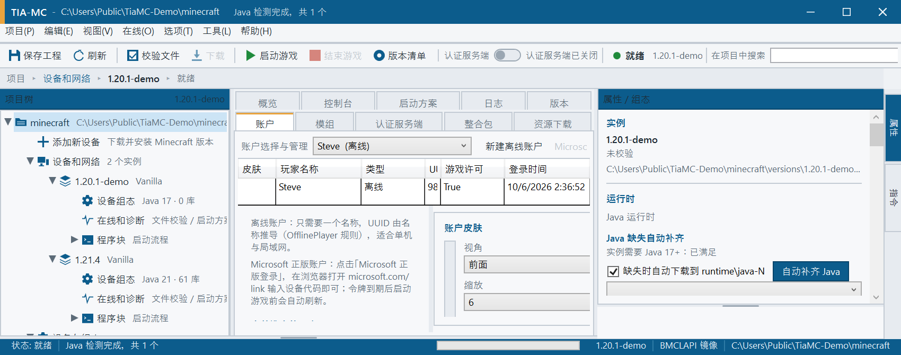

# 界面截图（Screenshots）

本页截图**全部来自一个独立演示环境**，用于文档展示：

* 演示目录：`C:\Users\Public\TiaMC-Demo`（**不含任何用户名与个人路径**）
* 演示实例：`1.20.1-demo`（Vanilla）
* 演示模组：`example-mod-a.jar`（Forge）/ `example-mod-b.jar`（Fabric），显示名 `Example Mod A / B`
* 演示账户：离线账户 `Steve`（Minecraft 默认名）
* 采集方式：`tools\capture-demo-shots.ps1`（界面自动化 + `tools\capture-window.ps1` 截图，再裁掉底部输出窗口）

> 因此仓库中的截图不会暴露你的本机路径、真实模组列表或账户信息。想生成自己的截图：
> 按上面的方式准备一个演示目录 → 让启动器指向它 → 运行 `tools\capture-demo-shots.ps1`。

---

## 主界面（TIA Portal 风格外壳）

工业蓝标题栏 + 功能区（保存工程 / 刷新 / 校验文件 / 下载 / 启动游戏 / 结束游戏 / 版本清单 / 认证服务端开关 / 在项目中搜索）、
左侧项目树（`.minecraft` → 设备和网络 → 实例 → 设备组态 / 在线和诊断 / 程序块）、中间工作页签、右侧属性/组态面板、底部输出窗口与状态栏。

## 版本页：正式版 / 快照 / 旧版分开

`正式版 N · 快照/测试版 N · 旧版 N · 已安装 N` 计数栏，配合「只看」下拉（全部 / 正式版 / 快照 / 旧版 / 已安装）与版本号搜索；
正式版蓝色「正式」徽章，快照橙色「测试」徽章并带橙色行底。

## 账户页：选择与管理集成 + 皮肤

顶部一行集中账户选择与账户管理（新建离线账户 / Microsoft 正版登录 / 刷新登录状态 / 删除账户）；
中间是账户列表（带皮肤头像列）；下方是「当前选中的账户」信息与皮肤面板。

皮肤面板：**实时预览**（改模板/颜色立即刷新）、可查看 **前 / 后 / 左 / 右 / 头部**、缩放 4/6/8/12 倍，
支持本地 PNG、模板生成、随机、外部皮肤站（mc-heads / Minotar / Crafatar / LittleSkin）与「同步到认证服务端」；
右侧还有**外置登录**（第三方皮肤站认证服务器，启动游戏时自动挂 authlib-injector）。

## 模组页：图标 + 中文界面

模组列表带 **图标列**（从 jar 内 `pack.png` / `icon.png` / `mods.toml logoFile` 提取，64×64）与装载器角标，
支持启用/停用、导入、打开目录、指定目录、Modrinth 在线下载（可选任意 MC 版本与装载器）。

## 整合包页：客户端 / 服务端分包

客户端整合包与服务端整合包分区管理（服务端**橙色高亮**）；支持 mrpack / CurseForge / 安装器 jar / 压缩包，
可一键「导入并加入实例」，服务端包还能生成 `tiamc-start.cmd` 与 `user_jvm_args.txt`。

## 资源下载页：四类内容一个入口

模组 / 整合包 / 资源包 / 光影统一搜索，支持**中文关键词**（如「机械动力」→ `create`）；
结果带 52×52 图标与类型徽章，双击文件即可下载到当前实例对应目录。

## 日志页：动作全记录 + 一键导出

日志级别筛选、「诊断上次启动」（17 条崩溃规则 + 疑似模组定位），以及日志导出：
**快速导出（推荐）**（不用选路径、自动回退到可写目录并把路径复制到剪贴板）、导出日志…（含 MC 的 `latest.log` / `debug.log` / `crash-reports`）、
导出诊断包…（zip）、打开日志文件夹、复制全部。用户动作会以 `动作` 级别记录（截图里可见「点击『校验文件』」）。

## 认证服务端页：单终端

内置 Yggdrasil 服务端（外置登录 / authlib-injector 兼容），13 个端点，单终端界面：`start [端口]`、`user add <角色名> <密码>`、
`skin <角色名>`、`api` 等命令；顶部功能区有一键开关，状态栏与日志会记录启停与端口。

---

截图仅用于展示界面；程序实际外观取决于你的 Windows 主题、DPI 缩放与窗口尺寸（分栏可拖动、输出窗口可调高）。
